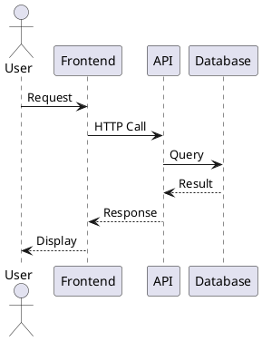

# Create Diagram

Generate visual architecture diagrams using Mermaid syntax and other diagramming tools.

## Diagram Generation

Diagram type: **$ARGUMENTS**

!`if [ -n "$ARGUMENTS" ]; then
    diagram_type="$ARGUMENTS"
    echo "🎨 Creating: $diagram_type diagram"
    
    case "$diagram_type" in
        "system"|"architecture")
            echo "🏗️  System Architecture Diagram"
            echo ""
            echo "\`\`\`mermaid"
            echo "graph TB"
            echo "    User[👤 User] --> Frontend[🎨 Frontend]"
            echo "    Frontend --> API[🔧 API Gateway]"
            echo "    API --> Auth[🔒 Authentication]"
            echo "    API --> Business[⚙️ Business Logic]"
            echo "    Business --> Database[🗄️ Database]"
            echo "    Business --> Cache[⚡ Cache]"
            echo "    API --> Logger[📝 Logging]"
            echo "    "
            echo "    subgraph \"Frontend Layer\""
            echo "        Frontend"
            echo "        UI[🖥️ UI Components]"
            echo "        State[📊 State Management]"
            echo "    end"
            echo "    "
            echo "    subgraph \"Backend Layer\""
            echo "        API"
            echo "        Auth"
            echo "        Business"
            echo "        Logger"
            echo "    end"
            echo "    "
            echo "    subgraph \"Data Layer\""
            echo "        Database"
            echo "        Cache"
            echo "    end"
            echo "\`\`\`"
            ;;
        "database"|"db")
            echo "🗄️  Database Architecture Diagram"
            echo ""
            echo "\`\`\`mermaid"
            echo "erDiagram"
            echo "    USERS ||--o{ PROJECTS : creates"
            echo "    USERS ||--o{ ISSUES : reports"
            echo "    PROJECTS ||--o{ ISSUES : contains"
            echo "    ISSUES ||--o{ COMMENTS : has"
            echo "    USERS ||--o{ COMMENTS : writes"
            echo "    "
            echo "    USERS {"
            echo "        int id PK"
            echo "        string email"
            echo "        string name"
            echo "        datetime created_at"
            echo "    }"
            echo "    "
            echo "    PROJECTS {"
            echo "        int id PK"
            echo "        string name"
            echo "        string key"
            echo "        int owner_id FK"
            echo "        datetime created_at"
            echo "    }"
            echo "    "
            echo "    ISSUES {"
            echo "        int id PK"
            echo "        string title"
            echo "        text description"
            echo "        int project_id FK"
            echo "        int reporter_id FK"
            echo "        string status"
            echo "        datetime created_at"
            echo "    }"
            echo "\`\`\`"
            ;;
        "flow"|"workflow")
            echo "🔄 Workflow Diagram"
            echo ""
            echo "\`\`\`mermaid"
            echo "flowchart TD"
            echo "    Start([Start]) --> Input[User Input]"
            echo "    Input --> Validate{Valid?}"
            echo "    Validate -->|No| Error[Show Error]"
            echo "    Error --> Input"
            echo "    Validate -->|Yes| Process[Process Data]"
            echo "    Process --> Save[Save to Database]"
            echo "    Save --> Success[Show Success]"
            echo "    Success --> End([End])"
            echo "    "
            echo "    style Start fill:#90EE90"
            echo "    style End fill:#FFB6C1"
            echo "    style Error fill:#FFA07A"
            echo "    style Success fill:#98FB98"
            echo "\`\`\`"
            ;;
        "sequence"|"seq")
            echo "📊 Sequence Diagram"
            echo ""
            echo "\`\`\`mermaid"
            echo "sequenceDiagram"
            echo "    participant User"
            echo "    participant Frontend"
            echo "    participant API"
            echo "    participant Database"
            echo "    "
            echo "    User->>Frontend: Click Login"
            echo "    Frontend->>API: POST /auth/login"
            echo "    API->>Database: Validate Credentials"
            echo "    Database-->>API: User Data"
            echo "    API-->>Frontend: JWT Token"
            echo "    Frontend-->>User: Redirect to Dashboard"
            echo "    "
            echo "    Note over User,Database: Authentication Flow"
            echo "\`\`\`"
            ;;
        "component")
            echo "🧩 Component Diagram"
            echo ""
            echo "\`\`\`mermaid"
            echo "graph LR"
            echo "    subgraph \"Application\""
            echo "        Router[🛣️ Router]"
            echo "        Header[📋 Header]"
            echo "        Sidebar[📂 Sidebar]"
            echo "        Main[📄 Main Content]"
            echo "        Footer[📋 Footer]"
            echo "    end"
            echo "    "
            echo "    Router --> Header"
            echo "    Router --> Sidebar"
            echo "    Router --> Main"
            echo "    Router --> Footer"
            echo "    "
            echo "    subgraph \"Main Content\""
            echo "        List[📋 List Component]"
            echo "        Detail[📝 Detail Component]"
            echo "        Form[📝 Form Component]"
            echo "    end"
            echo "    "
            echo "    Main --> List"
            echo "    Main --> Detail"
            echo "    Main --> Form"
            echo "\`\`\`"
            ;;
        "deployment")
            echo "🚀 Deployment Diagram"
            echo ""
            echo "\`\`\`mermaid"
            echo "graph TB"
            echo "    subgraph \"Production Environment\""
            echo "        LB[⚖️ Load Balancer]"
            echo "        App1[🖥️ App Server 1]"
            echo "        App2[🖥️ App Server 2]"
            echo "        DB[(🗄️ Database)]"
            echo "        Cache[(⚡ Redis Cache)]"
            echo "    end"
            echo "    "
            echo "    Internet[🌐 Internet] --> LB"
            echo "    LB --> App1"
            echo "    LB --> App2"
            echo "    App1 --> DB"
            echo "    App2 --> DB"
            echo "    App1 --> Cache"
            echo "    App2 --> Cache"
            echo "    "
            echo "    subgraph \"Monitoring\""
            echo "        Monitor[📊 Monitoring]"
            echo "        Logs[📝 Logs]"
            echo "    end"
            echo "    "
            echo "    App1 --> Monitor"
            echo "    App2 --> Monitor"
            echo "    DB --> Logs"
            echo "\`\`\`"
            ;;
        *)
            echo "❓ Custom diagram: $diagram_type"
            echo ""
            echo "💡 Basic diagram template:"
            echo "\`\`\`mermaid"
            echo "graph TD"
            echo "    A[Start] --> B{Decision}"
            echo "    B -->|Yes| C[Action 1]"
            echo "    B -->|No| D[Action 2]"
            echo "    C --> E[End]"
            echo "    D --> E"
            echo "\`\`\`"
            ;;
    esac
else
    echo "🎨 Available diagram types:"
    echo ""
    echo "📊 **system** - System architecture overview"
    echo "🗄️  **database** - Database schema and relationships"
    echo "🔄 **flow** - Workflow and process diagrams"
    echo "📈 **sequence** - Sequence and interaction diagrams"
    echo "🧩 **component** - Component structure diagrams"
    echo "🚀 **deployment** - Deployment and infrastructure diagrams"
    echo ""
    echo "💡 Usage: /create-diagram [type]"
    echo "Example: /create-diagram system"
fi`

## Current Project Analysis

!`echo "🔍 Project structure for diagramming:"`

### File Structure
!`echo "📁 Key directories:"`
!`find . -maxdepth 2 -type d -name ".*" -prune -o -type d -print | grep -E "(src|components|pages|api|models|services)" | head -8`

### Component Analysis
!`if find . -name "*.jsx" -o -name "*.tsx" -o -name "*.vue" | head -1 | grep -q .; then
    echo "🧩 Frontend components detected:"
    find . -name "*.jsx" -o -name "*.tsx" -o -name "*.vue" | head -5 | sed 's/.*\//  /'
fi`

### API Endpoints
!`if find . -name "*.js" -o -name "*.ts" | xargs grep -l "app\\.get\\|app\\.post\\|router\\." 2>/dev/null | head -1 | grep -q .; then
    echo "🔧 API endpoints detected:"
    find . -name "*.js" -o -name "*.ts" | xargs grep "app\\.get\\|app\\.post\\|router\\." 2>/dev/null | head -3 | sed 's/.*:/  /'
fi`

## Diagramming Tools

### Mermaid Syntax Reference

#### Graph Types
- **Flowchart**: `flowchart TD` or `graph TD`
- **Sequence**: `sequenceDiagram`
- **Entity Relationship**: `erDiagram`
- **User Journey**: `journey`
- **Gantt Chart**: `gantt`

#### Common Shapes
- **Rectangle**: `A[Text]`
- **Circle**: `B((Text))`
- **Diamond**: `C{Decision}`
- **Cylinder**: `D[(Database)]`
- **Subroutine**: `E[[Subroutine]]`

#### Connections
- **Arrow**: `-->`
- **Open Link**: `---`
- **Dotted**: `-.->` 
- **Thick**: `==>`
- **With Text**: `-->|Label|`

### PlantUML Alternative

For more complex diagrams, consider PlantUML:

## Diagram Best Practices

### Design Principles
1. **Clarity**: Keep diagrams simple and focused
2. **Consistency**: Use consistent symbols and colors
3. **Hierarchy**: Show clear relationships and dependencies
4. **Context**: Include sufficient context for understanding

### Visual Guidelines
- **Color Coding**: Use colors to group related components
- **Labeling**: Clear, descriptive labels for all elements
- **Direction**: Consistent flow direction (top-to-bottom, left-to-right)
- **Grouping**: Use subgraphs to group related components

## Integration with Documentation

### Documentation Generation
!`echo "📚 Documentation integration:"`
!`if [ -f "README.md" ]; then
    echo "✅ README.md exists - can embed diagrams"
    if grep -q "mermaid" README.md; then
        echo "✅ Mermaid diagrams already in README"
    else
        echo "💡 Consider adding diagrams to README"
    fi
else
    echo "💡 Create README.md to document architecture"
fi`

### Automated Documentation
- **GitHub**: Supports Mermaid diagrams in markdown
- **GitLab**: Native Mermaid support
- **Confluence**: Mermaid plugin available
- **Notion**: Diagram embedding supported

## Export Options

### Image Export
- **Mermaid CLI**: Export to PNG, SVG, PDF
- **Online Editors**: Mermaid Live Editor, Draw.io
- **IDE Plugins**: VS Code Mermaid extensions
- **Documentation Tools**: GitBook, Docusaurus integration

### Interactive Diagrams
- **Mermaid.js**: Interactive web diagrams
- **D3.js**: Custom interactive visualizations
- **Cytoscape.js**: Network/graph visualizations
- **Vis.js**: Network diagrams

## Next Steps

1. **Choose Diagram Type**: Select appropriate diagram for your needs
2. **Customize Content**: Modify the generated diagram for your specific use case
3. **Embed in Documentation**: Add diagrams to README or documentation
4. **Keep Updated**: Maintain diagrams as architecture evolves

Use `/design-system` for architecture planning and `/architecture-review` for analyzing existing systems.