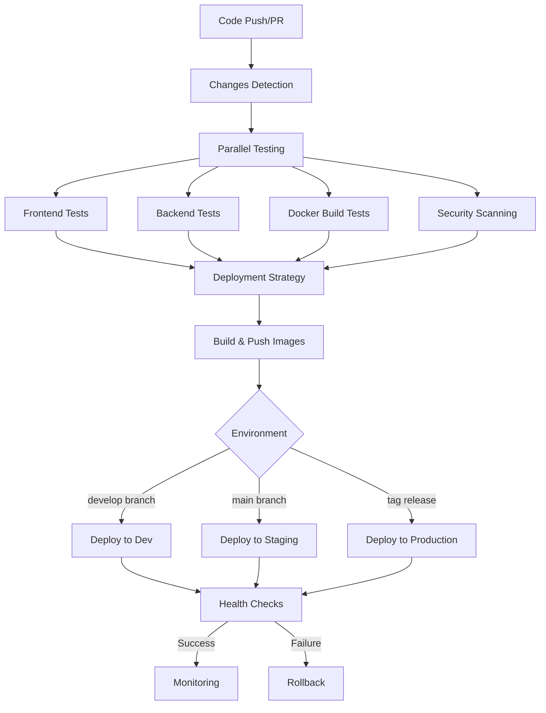

# DexAgents CI/CD Pipeline Documentation

## Overview

This document describes the comprehensive CI/CD pipeline for the DexAgents project, implemented using GitHub Actions. The pipeline provides automated testing, security scanning, building, and deployment across multiple environments.

## Pipeline Architecture



## Workflows

### 1. Main CI/CD Pipeline (`.github/workflows/ci.yml`)

**Triggers:**
- Push to `main` or `develop` branches
- Pull requests to `main` or `develop`
- Manual workflow dispatch
- Git tags starting with `v*`

**Jobs:**

#### Changes Detection
- Detects which components have changed
- Optimizes pipeline execution by running only necessary tests

#### Frontend Tests
- Node.js 18 setup
- NPM dependency installation
- ESLint code quality checks
- TypeScript type checking
- Unit tests (when available)
- Production build verification

#### Backend Tests
- Python 3.11 setup
- Pip dependency installation
- Flake8, Black, and isort code quality checks
- Unit tests with pytest
- Application startup verification

#### Docker Build & Test
- Multi-platform Docker builds
- Development environment testing
- Production environment testing
- Health check verification

#### Security Scanning
- Frontend dependency audit (npm audit)
- Backend dependency security (Safety, Bandit)
- Container vulnerability scanning (Trivy)
- SARIF report generation for GitHub Security tab

#### Deployment Strategy
- Determines target environment based on branch/tag
- Manages version tagging
- Controls deployment flow

#### Build & Push Images
- Builds and tags Docker images
- Pushes to GitHub Container Registry (ghcr.io)
- Implements semantic versioning
- Uses build caching for efficiency

#### Multi-Environment Deployment
- **Development**: Triggered by `develop` branch
- **Staging**: Triggered by `main` branch
- **Production**: Triggered by version tags (`v*`)

#### Health Checks & Monitoring
- Post-deployment verification
- Service health validation
- Performance monitoring
- Automated rollback on failure

### 2. Manual Rollback Workflow (`.github/workflows/rollback.yml`)

**Purpose:** Provides manual rollback capability for any environment

**Features:**
- Manual trigger with environment selection
- Version-specific rollback options
- Pre-rollback backup creation
- Health verification after rollback
- Audit trail and notifications

### 3. Security Scanning Workflow (`.github/workflows/security-scan.yml`)

**Purpose:** Dedicated security scanning and compliance checking

**Features:**
- Daily automated scans
- Dependency vulnerability scanning
- Container security assessment
- Dockerfile best practices validation
- Secrets detection
- SARIF report generation

### 4. Health Check Monitoring (`.github/workflows/health-check.yml`)

**Purpose:** Continuous health monitoring of deployed environments

**Features:**
- 15-minute interval health checks
- Deep health check options
- Performance monitoring
- Resource usage tracking
- Automated alerting on failures

## Security Features

### 1. Dependency Scanning
- **Frontend**: npm audit for JavaScript vulnerabilities
- **Backend**: Safety for Python vulnerabilities
- **Containers**: Trivy for container vulnerabilities

### 2. Static Code Analysis
- **Backend**: Bandit for Python security issues
- **Universal**: Semgrep for general security patterns

### 3. Container Security
- Base image vulnerability scanning
- Dockerfile best practices validation
- Runtime security checks

### 4. Secrets Management
- TruffleHog for secrets detection
- Environment-specific secret isolation
- Secure credential handling

## Deployment Strategies

### Development Environment
- **Trigger**: Push to `develop` branch
- **Strategy**: Direct deployment
- **URL**: `http://dev.dexagents.local`
- **Features**: Hot reloading, debug mode

### Staging Environment  
- **Trigger**: Push to `main` branch
- **Strategy**: Production-like deployment
- **URL**: `http://staging.dexagents.local`
- **Features**: Production configuration, smoke tests

### Production Environment
- **Trigger**: Git tags (`v*`)
- **Strategy**: Blue-green deployment
- **URL**: `https://dexagents.com`
- **Features**: Zero-downtime deployment, full test suite

## Version Management

### Semantic Versioning
- **Major**: `v1.0.0` - Breaking changes
- **Minor**: `v1.1.0` - New features
- **Patch**: `v1.1.1` - Bug fixes

### Image Tagging Strategy
```
ghcr.io/owner/dexagents/frontend:latest
ghcr.io/owner/dexagents/frontend:main-sha123456
ghcr.io/owner/dexagents/frontend:v1.2.3
ghcr.io/owner/dexagents/frontend:develop-sha789abc
```

## Environment Configuration

### Required Secrets
- `GITHUB_TOKEN`: For container registry access
- Environment-specific secrets for deployment targets

### Environment Variables
- `REGISTRY`: Container registry URL
- `IMAGE_NAME_FRONTEND`: Frontend image name
- `IMAGE_NAME_BACKEND`: Backend image name

## Rollback Procedures

### Automatic Rollback
- Triggered on deployment failure
- Health check failures
- Automated to previous known-good version

### Manual Rollback
- Available through GitHub Actions interface
- Can specify target version
- Includes pre-rollback backup
- Requires reason documentation

## Monitoring and Alerting

### Health Checks
- **Basic**: Service availability
- **Deep**: Database connectivity, API endpoints
- **Performance**: Response times, resource usage

### Alerting Channels
- GitHub Issues (automatic creation)
- Failed workflow notifications
- Security vulnerability alerts

## Usage Guide

### Triggering Deployments

#### Development Deployment
```bash
git checkout develop
git commit -m "feat: add new feature"
git push origin develop
# Automatically deploys to development
```

#### Staging Deployment
```bash
git checkout main
git merge develop
git push origin main
# Automatically deploys to staging
```

#### Production Deployment
```bash
git tag v1.2.3
git push origin v1.2.3
# Automatically deploys to production
```

### Manual Operations

#### Manual Deployment
1. Go to Actions tab in GitHub
2. Select "DexAgents CI/CD Pipeline"
3. Click "Run workflow"
4. Select environment and options

#### Manual Rollback
1. Go to Actions tab in GitHub
2. Select "Manual Rollback"
3. Click "Run workflow"
4. Select environment and target version
5. Provide rollback reason

### Local Testing

#### Test Pipeline Components
```bash
# Test the entire pipeline locally
./test-pipeline.sh

# Test specific deployment
./scripts/deploy.sh dev --health-check

# Test Docker builds
docker-compose build
docker-compose -f docker-compose.prod.yml build
```

## Best Practices

### Code Quality
- All code must pass linting and type checks
- Unit tests are required for new features
- Security scans must pass before deployment

### Security
- Regular dependency updates via Dependabot
- Container base images updated weekly
- Security scans on every deployment

### Deployment
- Always test in development first
- Staging deployment required before production
- Production deployments only through tagged releases

### Monitoring
- Monitor health checks after deployment
- Set up alerts for critical failures
- Regular review of security scan results

## Troubleshooting

### Common Issues

#### Build Failures
- Check dependency compatibility
- Verify Docker base image availability
- Review build logs in Actions tab

#### Deployment Failures
- Verify environment configuration
- Check health endpoint availability
- Review rollback options

#### Security Scan Failures
- Review vulnerability reports
- Update vulnerable dependencies
- Apply security patches

### Debug Commands

```bash
# Check local build
docker-compose build --no-cache

# Test health endpoints
curl http://localhost:8080/api/v1/system/health
curl http://localhost:3000/api/health

# View logs
docker-compose logs backend
docker-compose logs frontend
```

## Contributing

### Pipeline Changes
1. Test changes locally with `./test-pipeline.sh`
2. Create PR with detailed description
3. Ensure all security checks pass
4. Get review from DevOps team

### Adding New Environments
1. Update deployment strategy in `ci.yml`
2. Add environment-specific configuration
3. Update documentation
4. Test deployment process

## Support

For pipeline issues or questions:
- Create GitHub Issue with `ci/cd` label
- Contact DevOps team
- Review workflow run logs
- Check troubleshooting section

---

*This pipeline provides enterprise-grade CI/CD capabilities with security, reliability, and scalability at its core.*